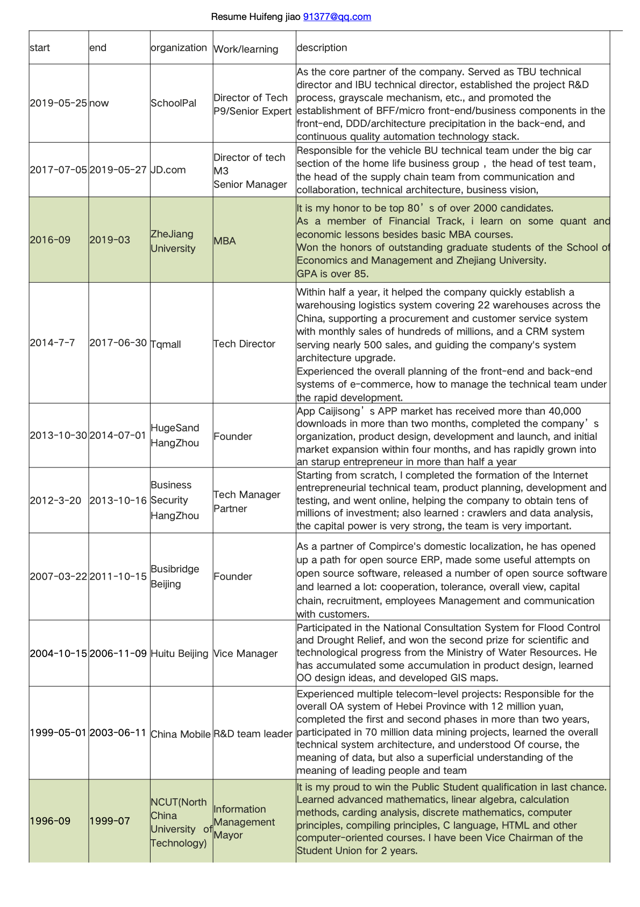

Updated ：

### **Personal information**

+ **Name:**  Huifeng Jiao 
+ **Location:**  HangZhou Zhejiang, China
+ **E-mail:**  
+ **Mobile:**  
+ **GPA：**85.38/ GPE 7.05/A level
+ **language:** Band 6 passed, IETL ,to be passed

### **Interest and research area**
+ Individul's natural property
+ Decentralized Tech, Block Chain
+ Complex Systems
+ Archi Design
+ R&D Management

### **Education**

+ MBA / Financial Track(involves quant, data analysis, probability ) graduate at 2019
+ ZheJiang University(**QS No. 53 in 2021** )
+ Information Management (almost Computer Science  plus Mathimatics)
+ North China University of Technology (NCUT)

### **Skill**

+ Relevant research experience on individuals and property
+ Basic research capacities: quantitative data analysis, programming, stata, matlab
+ **Rich working experience** in team communications, workflow design, system construction, project management, etc
+ Strong willingness and **ensusiansm** of  science research

### **Experience**

+ 

### **Publication**

+ Working Papers：**Redefining individual property**: privacy, choice and relationship besides basic assets, in proposal 
+ Draft：Start up 's 10 core concentration discussion: Changing with era, 2020
+ Study on the Influence of Social Network Factors on Individuals' Value, 《ZheJiang University》,Master thesis,2019
+ How to build a backbone Architecture with CRM、ERP and OMS、WMS、TMS, 《JD internal journal》2016
+ In Process, E-Commerce information framework evolution introduction , series article 2011
+ A inteligent BOSS system on China Mobile, 《China Mobile Tech Journal 》2004

+ How to build a win-win R&D team, 《Programmer》2003

### **Awards grants**

+ Outstanding Students Reward, School and Faculty level, 2018
+ Tchnological Innovation Enterprise, NingBo,  2011
+ Tchnological Innovation, Second Prize, China Ministry of Water Resources(Huitu tech), 2005

### **Society Memberships**

+ Zhejiang University MBA Entrepreneurship Club

+ Tencent Cross-Chain SIG group